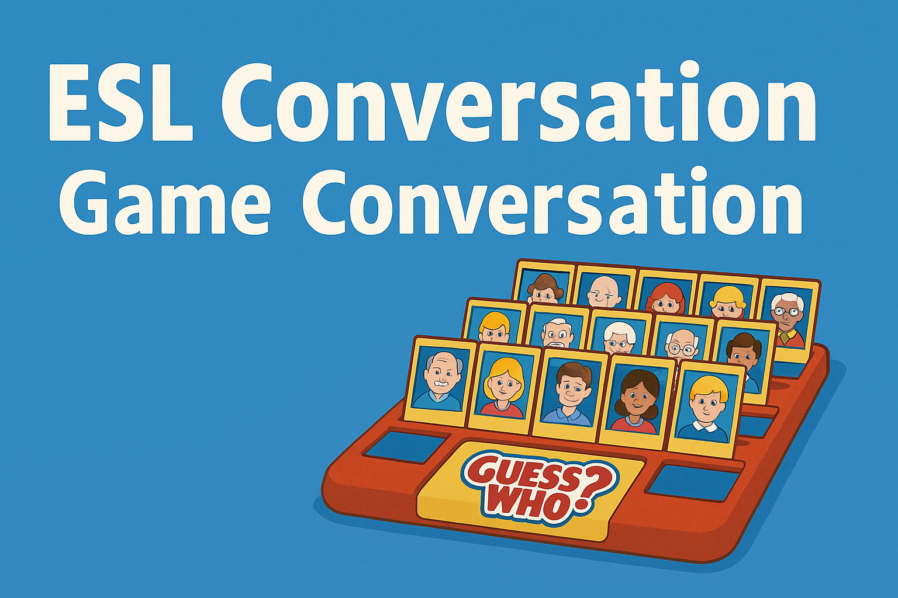

🛠️ **Prompt created by Abner Carvalho**  
📁 GitHub: [Johnny-armless](https://github.com/Johnny-armless)

---

## 📖 What It Does

This prompt automates a **"Guess Who"** classroom roleplay:

1. **Collects** teacher and student inputs (language, level, number of participants, names, dream locations, favorite famous people).
2. **Generates**:
   - **Teacher_Guide.docx**: full instructions, participant list, character mappings, 10 subtle clues per participant, and CEFR-based dialogue length guidelines.
   - **StudentDoc_<name>.docx**: one file per participant containing 10 clues and a 4-line mini-dialogue snippet (`Character<id>` & `Partner<id>`).
   - **AnswerKey.docx**: mapping of each participant’s name to their mystery character.
   - **GroupChat** & **PartnerDialogues** texts for debrief and enrichment.

---

## 🎯 Lesson Objective

- **Speaking & Listening**: Students read clues, formulate questions, and guess identities.
- **Vocabulary & Grammar**: Tailored to CEFR level (A1–C2) with appropriate complexity.
- **Cultural Awareness**: Dialogue snippets integrate participants’ dream locations and traditions.

---

## 👩‍🏫 Teacher Instructions

1. **Run the prompt** in ChatGPT (GPT-4 recommended).  
2. **Answer** all setup questions: language, level, participant count, and teacher info if needed.  
3. **Provide** each student’s name, dream location, and favorite famous person.  
4. **Download** generated `.docx` files: `Teacher_Guide.docx`, `AnswerKey.docx`, and `StudentDoc_<name>.docx` files.  
5. **Distribute** student files (without answers).  
6. **Have students** read 10 clues aloud.  
7. **Encourage classmates** to ask open-ended questions to deduce identities.  
8. **Reveal** answers with `AnswerKey.docx`.  
9. **Debrief** using `GroupChat` and `PartnerDialogues` for dynamic interaction.

---

## 🚧 What Can Go Wrong?

- **Files not generated**: If ChatGPT skips file creation, ask:
  - "Did you create the StudentDoc files?"
  - "Please generate the Teacher_Guide and AnswerKey docs."
- **Missing clues or dialogue**: Prompt:
  - "You forgot the mini-dialogue snippet—can you add it?"
  - "I need 10 clues per participant, please."
- **Incorrect CEFR complexity**:
  - "Adjust clues/dialogue length for level B1, please."

👉 **Tip**: You can request individual sections by quoting their `:: GEN[...]` tags.

---

## 📂 Files to Upload

- `guess_who_roleplay_prompt.md` (the full prompt)  
- `README.md` (this file)  
- `LICENSE` (MIT)  
- `banner.png` (visual header)  

---

## 🤝 Feedback & Improvements

Feel free to:
- Add more cultural variation in dialogues
- Tune clue difficulty per group needs
- Expand PartnerDialogues with more industry peers

---

© 2025 Abner Carvalho | MIT License